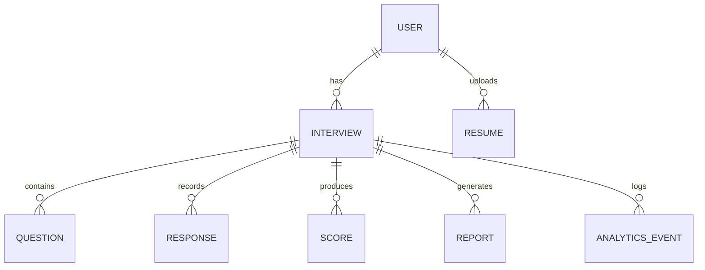

# ER Diagram

```mermaid
erDiagram
USER ||--o{ INTERVIEW : has
INTERVIEW ||--o{ QUESTION : contains
INTERVIEW ||--o{ RESPONSE : records
INTERVIEW ||--o{ SCORE : produces
INTERVIEW ||--o{ REPORT : generates
INTERVIEW ||--o{ ANALYTICS_EVENT : logs
USER ||--o{ RESUME : uploads
```
